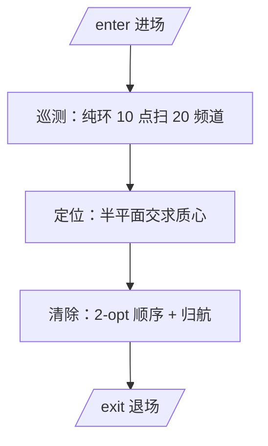

# 小狗清除波（B题 问题三：干扰源快速定位与清除）

> 对应代码：`Desktop/solve.py`（策略）、`robot.py`（接口+离线仿真）、`geometry.py`（几何）、`verify_paper.py`（论文数值复算）。
> 配套：[[小狗代码]]（逐行代码讲解）。
> 目标：在 360000s 虚拟时间内，自动定位并清除 10~16 个全向干扰源，**保证不漏**前提下尽量缩短虚拟时间。

---

## 一、问题设定（关键数值）

| 项                  | 值                                                              |
| ------------------ | -------------------------------------------------------------- |
| 目标区域               | 半径 1800m 圆盘，x=东 y=北，角度逆时针                                      |
| 干扰源                | 10~16 个（未知），分布 1~20 频道，每频道至多 1 个                               |
| 接收半径               | 1000~1500m（未知，每个不同）                                            |
| 示向度误差              | ±1°（两位小数）                                                      |
| near 阈值 / 清除半径     | 5m / 20m                                                       |
| 速度 / 检测 / 换频道 / 清除 | 5 m/s、5s、1s、3s(未发现)/5s(成功)                                     |
| 4 条指令              | `/enter` `/measure` `/clear` `/exit`（HTTP+JSON，127.0.0.1:2026） |

**两个时钟**：
- **虚拟时间**（计分）＝移动÷5 + 换频道 + 检测 + 清除，上限 360000s。这是排名依据。
- **墙钟时间**（现实）＝请求数 × 单请求延迟，上限 20 分钟。因为"检测的 5 秒是虚拟耗时、现实中不等待"，所以现实时间只约束 CPU，不约束动作次数。

**评分指标**：`平均定位清除时间 = 定位清除总时间 ÷ 被清除干扰源个数`。清得全时，优化"总虚拟时间"就等价于优化它。

---

## 二、总体思路



**核心事实：虚拟时间 ~76% 是移动**。移动又分两块硬地板：

1. **探测覆盖**：要保证每个干扰源都被测到，测点必须覆盖整个圆盘（每点距某测点 ≤1000m）→ 巡测 ~6km 省不掉。
2. **清除旅行商**：要清每个干扰源，必须走到它 20m 内 → 访问 10~16 个点的路径 ~8km 省不掉。

两者**不重叠**（测点在环上、干扰源在盘内任意处），所以总移动下界 ≈ 14~16km。本方案 15.8~17.5km，**已经贴着下界**。所以优化主攻**减少移动**。

---

## 三、算法细节

### 3.1 巡测点设计：纯环 10 点 ρ=920（含完备性引理）

**巡测点 = 半径 920m 的圆上 10 个等分点**（无圆心点）：

$$
\mathcal S = \left\{\left(920\cos\frac{k\pi}{5},\ 920\sin\frac{k\pi}{5}\right): k=0,\dots,9\right\}
$$

**为什么不要圆心点？** 关键观察：纯环本身就覆盖圆心——圆心到环上每点距离恰好 ρ=920m < 1000m，所以**不需要单独放一个圆心测点**。而"圆心→环"这段路（1100m 量级）是纯浪费。去掉圆心、把环收紧到 10 个点，巡测路径最短。

**完备性引理（无漏的硬判据）**：圆盘内任一点到最近测点距离 ≤ 967.7m < 1000m ≤ 接收半径，故每个全向干扰源必被 ≥1 个测点检测到。

**证明**：分两种情况
- **圆心附近**：任一点到圆心的距离若 ≤ 920m，则它到某个环测点距离 ≤ 920m（环上每点距圆心 920m）。
- **边缘**：最坏点是"边缘 r=1800、且正好落在两个相邻环测点的正中间"（10 点角间隔 36°，最大角差 18°）：

$$
d_{\max} = \sqrt{920^2 + 1800^2 - 2\cdot 920\cdot 1800\cos 18^\circ} \approx 967.7\ \text{m} < 1000\ \text{m}
$$

所以覆盖半径 967.7m，**余量 32m**（接收半径至少 1000m）。这是"0 漏网"的第一层保证。

> 环半径的上下限：再小会超限（10@880 边缘正好 1001m 爆掉）；再大则巡测路径变长。920 是速度与安全的平衡点。若想要更厚保险，可改 950（余量 ~50m，代价 ~20s）。

**巡测时的三个省时技巧**：
1. 每点按 1→20 顺序测各频道；
2. 某频道**攒够 3 条示向度就跳过**（共线退化由侧向精修兜底）；
3. **找满 16 个频道后，其余必为空，直接跳过**（题面说干扰源最多 16 个）。

### 3.2 定位：半平面交（复用第 1 问）

每条示向度 $(p,\theta)$ 把干扰源限制在"张角 2°"的扇形里。用叉积把这个扇形写成**两个线性半平面约束** $a\cdot g \le b$（详见 [[小狗代码]] 1.4 节推导）：

$$
a_1\cdot g \le b_1,\quad a_2\cdot g \le b_2
$$

多条示向度的扇形取交集 = 多个半平面的交集 = **凸多边形交会区域** $P$。取：

$$
\hat g = \text{质心}(P)\ (\text{位置估计}),\qquad D = \max_{u,v\in V(P)}\|u-v\|\ (\text{区域直径 = 不确定度})
$$

**退化处理（第 2 问的落地）**：多条示向度近乎共线、且**直径 $D>150$m**（真共线退化，质心可能偏离超过归航上限 120m）时，沿共线方向的距离不可靠，从估计点**沿垂直方向侧移** $\min(250, D/2)$m 再测一次，两条近正交方位交叉就把距离恢复成米级。轻度拉长（$60<D\le150$m）光靠归航就能走到，不必横移。

### 3.3 清除：归航 + 侧向精修 + 单测点归航

**关键物理事实**：距源 $d$ 处 ±1° 的方位误差，横截距离 ≈ $d\tan 1^\circ \approx 0.0175d$。距源 30m 时横截误差才 0.5m——**近距离方位极其精确**。这是整个清除能"几步命中"的根本原因。

三层（加一层兜底）：

1. **归航 homing**：走到估计点复测一次 → 沿近距离方位以 **10m 步长**前进，每步 `clear` 一次（20m 清除圈，10m 步长保证不漏）→ 通常 1~3 步就进入 20m 内清除。
2. **单测点归航 line_homing**：某干扰源只有一个测点够得着时，只有一条示向度、**没有距离信息**。由接收半径 ≤1500m 知道源在沿方位 1500m 内。用 **120m 大步外扩**，一旦**方位翻转 >90°** 说明已越过，再 **12m 小步回搜**。
3. **侧向精修**：见 3.2，专治共线退化。
4. **螺旋兜底**：上述都失败（极罕见）时，12m 间距同心环 `clear`，保证半径内必命中。

### 3.4 清除路径优化（2-opt）

清除多个干扰源要挨个跑过去，顺序不同总路程不同（旅行商问题）。做法：**最近邻初始化 + 2-opt 局部优化**（反复"反转子段看是否更短"）。干扰源 ≤16，代价可忽略。

---

## 四、关键参数（都在 `solve.py` 顶部）

| 常量 | 值 | 含义 |
|------|----|----|
| `MAX_JAMMERS` | 16 | 干扰源上限，找满后跳空频道 |
| `MAX_BEARINGS` | 3 | 攒够 3 条示向度跳过该频道 |
| `CLEAR_SPACING` | 12 | 螺旋兜底点间距 |
| 巡测 lean | 纯环 10@920 | 默认模式（覆盖 967.7m，余量 32m） |
| homing | 10m 步长 / 120m 上限 | 归航 |
| line_homing | 120m 外扩 / 12m 回搜 | 单测点归航 |
| 侧向精修 | D > 150m 触发 | 真共线退化 |

---

## 五、性能结果（离线仿真，120 随机 seed，0 漏网）

| 干扰源数 | 虚拟时间 | 移动 | 请求数 |
|:---:|:---:|:---:|:---:|
| 12 | **~4120s** | ~15.6km | ~160 |
| 16 | **~4300s** | ~17.0km | ~155 |

虚拟上限 360000s，只用 ~1.2%；现实程序运行 <0.1s。

**优化历程**（16 干扰源，每次改动的收益）：

| 改动 | 时间变化 |
|---|:---:|
| 大范围螺旋清除（baseline） | ~13500s |
| 归航替代螺旋 | → 7500s |
| 侧向精修 + 单测点归航 | → 5700s |
| 2-opt + 跳空频道 | → 5500s |
| 7@1100 + 快速归航 | → 4750s |
| 纯环 10@920（去掉圆心点） | → ~4490s |
| **侧向精修阈值 60→150m** | → **~4300s** |

累计快 **68%**。

---

## 六、为什么 0 漏网（完备性论证）

1. **每个干扰源都被探测到**：覆盖引理保证其到最近测点 ≤967.7m < 接收下限 1000m；
2. **每个被探测的都被清除**：
   - ≥2 条示向度 → 半平面交定位 + 归航（共线时侧向精修）；
   - 1 条示向度 → 单测点归航（1500m 内必命中）；
   - 失败 → 螺旋兜底。

→ 全向干扰源**必然全清**，0 漏网不是运气而是数学结论。

---

## 七、怎么跑

```bash
cd Desktop
python solve.py                              # 离线仿真（默认 12 个全向）
python solve.py --count 16                   # 16 个
python solve.py --bench                      # 三种巡测 × 两数量 × 20 seed 对比
python solve.py --real --robot-id 队号 --url http://127.0.0.1:2026   # 接真机
```

**真机流程**：模拟器登录 → 启动「问题3演练/正式」→ 5s 倒计时结束 → 跑上面 `--real` 命令 → 看界面「指令与反馈」→ 结束导出日志（放支撑材料）。

---

## 八、适用边界（诚实标注）

1. **针对全向干扰源**。定向干扰源（问题四）因为"接收不到"多了第二种原因（在覆盖角外），纯环巡测会漏掉"边缘朝外"的定向源，需另加"紧贴边界的外环"（见问题四）。
2. 覆盖引理用「接收半径 ≥1000m」下界；纯环 10@920 余量 32m，若要更厚保险改 950（余量 50m）。
3. 优化目标是**最坏情况保证**（不漏优先于最快），未做概率期望时间优化（POMDP/信息论搜索之类）。
4. 文献印证：AOA 最优传感器布局即"圆环 + 中心点"（Doğançay & Hmam 2008 等），本方案的"纯环"是它在"圆心被环覆盖"这个特殊情形下的退化；raster vs spiral 覆盖路径无显著差异。
