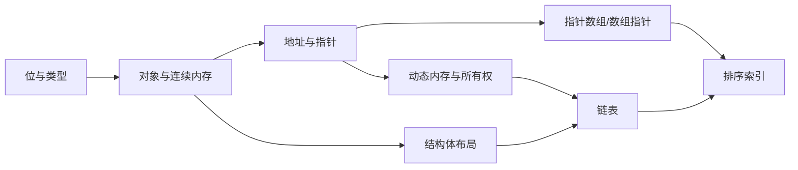

# C 语言学习笔记

> 这套笔记不把 C 当成一堆语法来背，而是围绕四个问题展开：**数据在哪里、地址指向谁、对象活多久、谁负责释放**。

---

## 一、学习顺序

| 阶段 | 笔记 | 要解决的问题 |
|---|---|---|
| 1. 看懂数据 | [[01-数制、字符与数据表示]] | 一个数或字符进入内存后，到底变成了什么位模式？ |
| 2. 与程序交互 | [[02-输入输出与字符处理]] | `printf`、`scanf`、`getchar` 的格式与类型为什么必须匹配？ |
| 3. 控制执行 | [[03-流程控制与循环]] | 条件、循环、`break`、`continue` 怎样改变控制流？ |
| 4. 划分程序 | [[04-函数、作用域与生命周期]] | 参数怎么传，变量什么时候出现、什么时候失效？ |
| 5. 认识连续内存 | [[05-数组、字符串与内存布局]] | 数组、字符串和 `\0` 与连续字节有什么关系？ |
| 6. 认识地址 | [[06-指针与C内存模型]] | 指针的值、指针自己的地址、解引用和所有权分别是什么？ |
| 7. 掌握指针组合 | [[07-指针数组、数组指针与多级指针]] | `int *a[N]`、`int (*a)[N]`、`int **a` 为什么完全不同？ |
| 8. 组织复杂对象 | [[08-结构体、内存对齐与所有权]] | 结构体怎样布局，含指针成员时为什么不能盲目复制？ |
| 9. 连接离散对象 | [[09-链表与动态内存]] | 节点为何能分散在堆上，却仍组成一个有序序列？ |
| 10. 综合起来 | [[10-综合实战-学生信息系统]] | 怎样让链表拥有对象、让指针数组只做排序视图？ |
| 11. 找出问题 | [[11-未定义行为、调试与自测]] | 越界、悬空、重复释放等问题怎样定位和预防？ |

---

## 二、整套笔记的核心模型



学习时反复问下面四个问题：

1. **对象是什么类型？** 类型决定占用空间、解释方式和指针步长。
2. **对象存在哪里？** 自动、静态或动态存储期决定它能活多久。
3. **当前表达式有几层地址？** `p`、`*p`、`**p` 每少一个 `*`，就少走一层地址。
4. **谁拥有这块动态内存？** 拥有者负责且只负责释放一次；借用者不能擅自 `free`。

> ✅ 如果一段指针代码能画出内存图、说清生命周期和所有权，它通常就不再难。


## 三、示例代码的阅读方法

复杂代码中的注释会重点标出四类信息：

```c
// 难点：为什么需要这一层指针或这个不变量
// 所有权：谁申请、谁释放，函数是否接管对象
// 边界：空数组、空链表、尾后一位等特殊情况
// 失败路径：内存申请失败后，已经完成的部分怎样回滚
```

建议每读完一个复杂示例都做三件事：

1. 手画对象与箭头，不抄代码。
2. 在每次 `malloc` 旁写出与它配对的 `free`。
3. 分别代入空数据、一个元素和多个元素，检查边界。

---

## 四、建议的编译方式

GCC 或 Clang：

```bash
cc -std=c11 -Wall -Wextra -Wpedantic -Wconversion -g example.c -o example
```

调试内存问题时（编译器支持的情况下）：

```bash
cc -std=c11 -Wall -Wextra -Wpedantic -g \
   -fsanitize=address,undefined example.c -o example
```

> ⚠️ 代码“能运行一次”不等于正确。C 中的越界和悬空访问可能暂时不崩溃，却已经属于未定义行为。详见 [[11-未定义行为、调试与自测]]。

---

## 相关笔记

- [[05-数组、字符串与内存布局]]
- [[06-指针与C内存模型]]
- [[07-指针数组、数组指针与多级指针]]
- [[08-结构体、内存对齐与所有权]]
- [[09-链表与动态内存]]
- [[10-综合实战-学生信息系统]]
