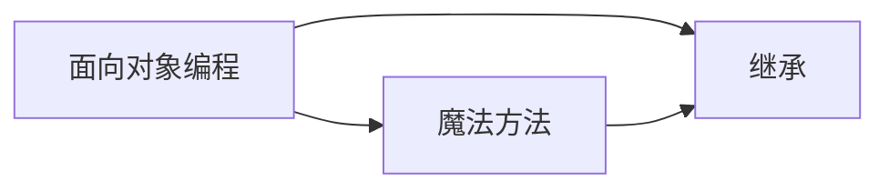
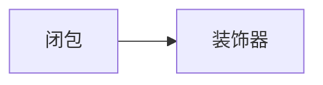

# Python 学习笔记

> Python 编程笔记，涵盖数据结构、面向对象与函数进阶。

---

## 一、数据结构（四大核心容器）

Python 内置四种最常用的容器类型，各有各的适用场景：

- [[列表]] — 可变序列，最通用的容器，支持增删改查
- [[元组]] — 不可变序列，适合存储配置参数、坐标等不需修改的数据
- [[集合]] — 无序、不重复，擅长去重和数学集合运算
- [[字典]] — 键值对映射，用标签快速查找数据

### 选型速查

| 场景 | 推荐 |
|---|---|
| 存一批传感器读数，后续要增删 | [[列表]] |
| 存 PID 参数、坐标等固定配置 | [[元组]] |
| 去重、快速判断"在不在" | [[集合]] |
| 用名字/标签来查找数据 | [[字典]] |

---

## 二、文本处理

- [[正则表达式]] — 从串口日志、传感器数据中提取数字和关键字

---

## 三、面向对象编程（OOP）

把现实世界的设备抽象成代码中的"类"，是嵌入式 Python 开发的核心思维。

- [[面向对象编程]] — 类、对象、`__init__`、`self`、属性与方法
- [[魔法方法]] — `__str__`、`__add__`、`__len__` 等让对象"说人话"的内置钩子
- [[继承]] — 代码复用，子类自动获得父类的全部能力

### 学习路线

先搞懂类和 self → 再学魔法方法让类更 Pythonic → 最后用继承消除重复代码。

---

## 四、函数进阶

从普通函数到装饰器的进阶路线，**必须按顺序学**，因为后一个以前一个为基础：

- [[闭包]] — 内部函数留住外层变量，函数执行完变量不销毁
- [[装饰器]] — 闭包的工程应用，不改原函数代码就能加功能

> ⚠️ 装饰器的本质就是闭包。不理解闭包就看不懂装饰器，建议先把 [[闭包]] 吃透。

---

