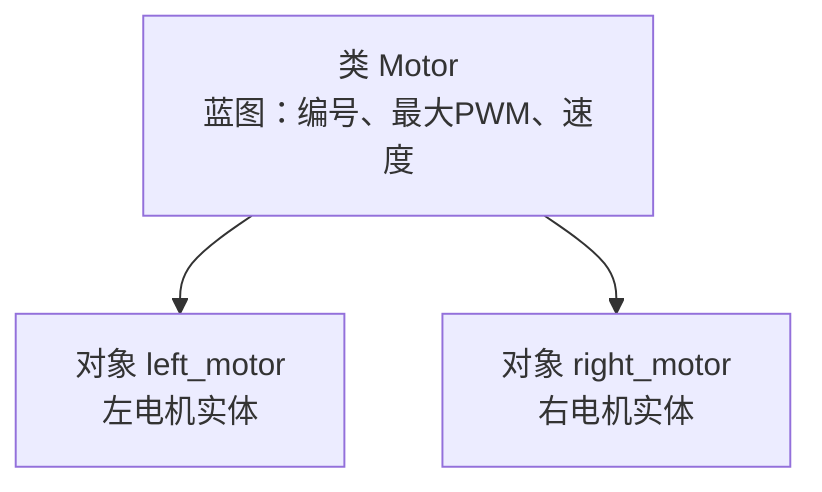

# 面向对象编程（OOP）

> 把现实世界的事物抽象成代码中的"类"，是 Python 面向对象的核心思维。

---

## 一、什么是类？什么是对象？

- **类（Class）**：蓝图/模板。比如"电机"的设计图纸。
- **对象（Object）**：根据蓝图造出来的实物。比如"左电机"、"右电机"。



---

## 二、类的解剖学：代码实现

定义一个"电机类"，需要掌握两个核心概念：**属性**（它是什么样）和**方法**（它能做什么）。

```python
class Motor:
    # 1. 构造函数：电机的"出厂配置"
    def __init__(self, motor_id, max_pwm=255):
        self.id = motor_id          # 属性：电机编号
        self.max_pwm = max_pwm      # 属性：最大占空比
        self.current_speed = 0      # 属性：当前速度
        print(f"电机 {self.id} 初始化完成！")

    # 2. 方法：电机的"功能按键"
    def set_speed(self, speed):
        if speed > self.max_pwm:
            speed = self.max_pwm
        self.current_speed = speed
        print(f"电机 {self.id} 速度设为: {self.current_speed}")

    def emergency_stop(self):
        self.current_speed = 0
        print(f"!!! 电机 {self.id} 紧急停止 !!!")

# --- 实战：实例化 ---
# 就像从蓝图（类）制造出真正的电机（对象）
left_motor = Motor(1)
right_motor = Motor(2)

left_motor.set_speed(150)
left_motor.emergency_stop()
```

---

## 三、两个必须要搞懂的关键词

### ① `__init__`（初始化方法 / 构造函数）

它是类的"出生证明"。当你执行 `Motor(1)` 时，Python 会自动跑一遍这个函数，把电机的 ID、最大功率等初始参数设置好。

`__init__` 是对象创建时自动运行的第一段代码，负责给属性赋初始值。

### ② `self`（自我指代）

把 `self` 理解为对象的"身份证"。

你创建了 `left_motor` 和 `right_motor`。当 `left_motor.set_speed(100)` 时，`self` 确保修改的是**左电机**的速度，而不是把右电机给加速了。

#### ✅ 有 self：拥有"记忆"的对象

```python
class PIDController:
    def __init__(self, kp):
        self.kp = kp
        self.last_error = 0  # self 把变量"焊"在了对象上

    def calculate(self, current_error):
        diff = current_error - self.last_error
        self.last_error = current_error  # 更新记忆
        return self.kp * current_error + diff
```

即使函数运行完了，`last_error` 也会被保存在内存里，等下一次循环时继续使用。

#### ❌ 没有 self：严重的"失忆症"

```python
class BadPIDController:
    def __init__(self, kp):
        kp = kp            # 没有 self，只是临时变量
        last_error = 0     # 函数结束后就被销毁

    def calculate(self, current_error):
        diff = current_error - last_error  # ❌ 报错！不认识 last_error
        return kp * current_error + diff
```

---

## 四、类内访问的两种形式

### ① 访问属性（内部数据共享）

```python
class PID:
    def __init__(self, kp, target):
        self.kp = kp
        self.target = target

    def update(self, current_val):
        # 【类内访问】读取属性
        error = self.target - current_val
        return self.kp * error
```

### ② 访问方法（内部功能嵌套）

```python
class MotorController:
    def _limit_pwm(self, pwm):
        # 私有辅助方法，限制 PWM 范围在 0-255
        return max(0, min(255, pwm))

    def set_speed(self, raw_pwm):
        # 【类内访问】调用另一个方法
        safe_pwm = self._limit_pwm(raw_pwm)
        print(f"执行硬件操作，写入 PWM: {safe_pwm}")
```

### 类内 vs 类外对比

```python
# 类内：
def accelerate(self):
    self.speed += 10    # 内部访问，用 self

# 类外：
my_car = Car()
my_car.speed += 10      # 外部访问，用对象名
```

---

## 五、为什么要用 OOP？

1. **数据保护（封装）**：内部状态不希望被外部随意修改，只允许通过类的方法访问
2. **减少重复代码**：写一个"数据校验"方法，所有需要校验的地方都内部调用它
3. **逻辑清晰**：把复杂任务拆成多个独立方法，主方法只负责流程调度

---

## 相关笔记

- [[魔法方法]] — `__init__` 就是最常用的魔法方法，还有 `__str__`、`__del__` 等
- [[继承]] — 子类自动获得父类的属性和方法，代码复用的终极武器
- [[闭包]] — 另一种"带记忆"的机制，和 self 异曲同工
- [[字典]] — 对象的 `__dict__` 属性本质上就是一个字典
- [[Python]]
