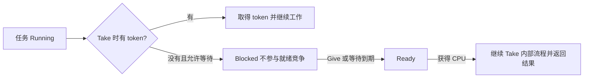

# FreeRTOS 计数信号量：从计数原理到中断与资源池

> [!abstract] 一句话理解
> 计数信号量是一个由内核维护的、有上限的 **token 计数器**，还带有“没有 token 就阻塞等待”的能力。`Give` 增加一个 token，`Take` 成功时拿走一个 token。你需要先规定：这个 token 表示“一次待领取事件”，还是“一份可用资源”。

> [!important] 阅读主线
> **计数含义 → API 与任务阻塞 → 中断交接 → 事件计数实例 → 缓冲区资源池 → 内存与并发 → 选型和排错。**
>
> 本篇使用 FreeRTOS 原生 C API；以单核 STM32 Cortex-M3/M4 项目为主要背景。示例中的板级接口需要按自己的工程实现，不能直接当作完整的 CubeMX 工程烧录。API 细节核对 FreeRTOS-Kernel V11.2.0，实际工程仍以所用内核和 port 为准。

## 快速导航

1. [[#1. 先分清两种计数含义]]
2. [[#2. Give 和 Take 到底改变了什么]]
3. [[#3. 创建、配置与对象生命周期]]
4. [[#4. 阻塞、超时与任务调度]]
5. [[#5. 中断里怎样正确交接工作]]
6. [[#6. 项目实例一：中断事件累计与后台处理]]
7. [[#7. 项目实例二：多任务共享固定缓冲区池]]
8. [[#8. 缓冲区、指针与 DMA 的生命周期]]
9. [[#9. 内核实现与 RAM 占用]]
10. [[#10. 二值信号量、互斥锁、队列和任务通知]]
11. [[#11. 最大计数怎样确定]]
12. [[#12. 常见错误与调试顺序]]
13. [[#13. 自测与项目练习]]
14. [[#14. 关联笔记与官方资料]]

---

## 1. 先分清两种计数含义

### 1.1 事件型：还有多少次事件没有被任务领取

假设光电传感器检测到一个物体就产生一次有效事件。任务只需要统计物体数量，每次事件没有额外数据。

```text
初始没有事件：count = 0
连续收到三次事件：Give、Give、Give → count = 3
任务领取一次：Take 成功 → count = 2
任务处理刚领取的那一次事件
```

这里通常创建为 `xSemaphoreCreateCounting(最大积压数, 0)`。

**成功 Take 后，计数就已经减一；业务处理可能还没开始。** 因此，`count` 更准确地表示“尚未领取的 token 数”，不能直接当作“所有未完成工作数”，也不是开机以来的累计事件总数。

如果一个任务已经取走 1 个 token 正在处理，而信号量中还剩 3 个，那么这时有 4 次工作尚未完成。业务处理失败时，是否重试、丢弃或补回 token，由业务协议决定；信号量不会自动重试。

### 1.2 资源型：还有多少份资源可以申请

假设程序预留了 4 块通信缓冲区：

```text
初始全部空闲：count = 4
任务 A 申请一块：Take → count = 3
任务 B 申请一块：Take → count = 2
任务 A 用完归还：Give → count = 3
```

这里通常创建为 `xSemaphoreCreateCounting(4, 4)`。每次成功申请最终都需要对应一次有效归还。

| 比较          | 事件计数         | 资源计数        |
| ----------- | ------------ | ----------- |
| token 的含义   | 一次尚未领取的事件    | 一份可申请的资源许可  |
| 常见初始值       | 0            | 资源总数 N      |
| 谁 Give      | 事件生产者或 ISR   | 资源使用者/归还管理者 |
| 谁 Take      | 事件处理任务       | 资源申请任务      |
| 处理完后是否 Give | 通常不需要，事件已经消费 | 需要，恢复资源许可   |
| 达到最大值       | 待领取事件积压到上限   | 全部资源已可用     |

> [!warning] 初始值取决于事实
> 合法范围是 `0 ≤ initial ≤ max`，且 `max > 0`。并不是只能填 0 或 max：若 4 份资源中启动时只有 2 份可用，可以初始为 2，但资源管理表也必须反映同样的状态。

这两类用途是 FreeRTOS 官方介绍计数信号量时采用的基本模型。参见 [官方计数信号量说明](https://www.freertos.org/Documentation/02-Kernel/02-Kernel-features/02-Queues-mutexes-and-semaphores/03-Counting-semaphores)。

## 2. Give 和 Take 到底改变了什么

假设最大计数为 `M`，调用前计数为 `C`：

| 操作与条件 | 对计数的影响 | 调用结果 |
|---|---|---|
| `Give`，`C < M` | 增加 1 | 成功；可能让等待任务就绪 |
| `Give`，`C == M` | 不变 | 失败，不会自动覆盖或等待 |
| `Take`，`C > 0` | 减少 1 | 成功，调用方拿到一个 token |
| `Take`，`C == 0`，等待时间为 0 | 不变 | 立即失败 |
| `Take`，`C == 0`，允许等待 | 尚未取得 token | 调用任务进入阻塞；以后可能成功或超时 |

表格描述一次操作本身。调用返回后，其他任务或中断可能已经改变计数，所以再去观察时不一定恰好等于表中数值。

```c
/* 任务上下文中的基本用法片段。sem 必须已经创建成功。 */
if (xSemaphoreTake(sem, pdMS_TO_TICKS(20)) == pdTRUE)
{
    /* 只有成功分支才拥有这个 token，才能继续相关工作。 */
}
else
{
    /* 没拿到 token：可以记录超时、稍后重试或放弃本次请求。 */
}

/* Give 没有等待超时参数；满计数时立即失败。 */
BaseType_t result = xSemaphoreGive(sem);
if (result != pdTRUE)
{
    /* 事件型：检查积压；资源型：检查重复归还或计数不一致。 */
}
```

`Take` 返回值回答“本次是否取得 token”，`Give` 返回值回答“本次是否成功放入 token”。它们都不返回剩余计数。

### 计数信号量不会保存事件内容

假设 ADC 三次转换结果是 `100、200、300`，ISR 每次覆盖 `latestAdc` 后 Give。最后信号量里有 3 个 token，但 `latestAdc` 可能只剩 `300`。任务 Take 三次，也可能读到三次 `300`。

因此，要求保留每个采样值、时间戳或串口数据包时，应使用能保存数据的队列、环形缓冲区或 DMA 缓冲区，并定义对应的同步协议。计数值为 3 只能证明还保存了 3 个 token，无法还原三份历史数据。

## 3. 创建、配置与对象生命周期

### 3.1 配置项

按工程已有配置修改，避免重复定义：

```c
#define configUSE_COUNTING_SEMAPHORES       1
#define configSUPPORT_DYNAMIC_ALLOCATION    1  /* 使用动态创建时需要 */
#define configSUPPORT_STATIC_ALLOCATION     1  /* 使用静态创建时需要 */
#define INCLUDE_vTaskSuspend                1  /* Take 的无限等待语义 */
```

动态、静态分配可以按需求只启用一种。本文事件实例使用动态创建，资源池信号量使用静态创建；两例都通过 `xTaskCreate` 创建任务，因此还需要动态分配支持。启用静态分配后，Idle/Timer 任务的静态内存支持按内核版本和工程配置提供。

### 3.2 动态创建

```c
#include "FreeRTOS.h"     /* 放在其他 FreeRTOS 头文件之前 */
#include "task.h"
#include "semphr.h"

SemaphoreHandle_t eventSem;

void CreateEventSemaphore(void)
{
    eventSem = xSemaphoreCreateCounting(32, 0);
    if (eventSem == NULL)
    {
        /* 创建失败：不得继续启用依赖它的中断或任务。 */
        /* 工程中应在这里调用自己的初始化失败处理函数。 */
        return;
    }
}
```

对象从 FreeRTOS 所配置的堆中分配；失败时返回 `NULL`。句柄变量只是用于访问对象的引用，不是整个信号量本体。

### 3.3 静态创建

```c
static StaticSemaphore_t resourceSemStorage;
static SemaphoreHandle_t resourceSem;

void CreateResourceSemaphore(void)
{
    resourceSem = xSemaphoreCreateCountingStatic(
        4, 4, &resourceSemStorage);
    /* 有效参数下使用调用者提供的存储，不为该信号量申请堆内存。 */
}
```

`resourceSemStorage` 必须在整个对象使用期间都有效。不能把它定义为初始化函数中的普通局部变量，函数返回后还让任务继续使用它。函数内的 `static` 局部变量则有静态存储期，可以使用。

### 3.4 建立和销毁的顺序

```text
外设中断保持禁用
    → 创建信号量并检查结果
    → 创建使用它的任务并检查结果
    → 启动调度器
    → 任务清理启动前残留标志，配置并启用中断
```

初始化只做一次，不要重复覆盖正在使用的句柄。删除对象前必须先停止所有生产者、消费者和相关 ISR，并协调结束等待；`vSemaphoreDelete` 不承担“安全取消所有用户”的业务功能。动态对象能否回收内存还取决于所选 heap 实现，例如 `heap_1` 不支持释放。

创建参数和存储要求可查 [semphr.h 的创建 API 定义](https://github.com/FreeRTOS/FreeRTOS-Kernel/blob/V11.2.0/include/semphr.h)，配置背景见 [[freertos/配置文件]]、[[freertos/堆内存管理]]。

## 4. 阻塞、超时与任务调度

### 4.1 等待不会一直占用 CPU



阻塞期间，任务栈和 TCB 仍占 RAM，CPU 可以去执行别的 Ready 任务。忙轮询 `while (xSemaphoreTake(sem, 0) != pdTRUE) {}` 则会消耗 CPU；若该任务优先级高，还可能使负责 Give 的低优先级任务无法运行。

### 4.2 时间单位是 Tick

| 参数 | 含义 |
|---|---|
| `0` | 本次不等待 |
| `pdMS_TO_TICKS(20)` | 将 20 ms 换算成 Tick 的等待预算 |
| `portMAX_DELAY` | `INCLUDE_vTaskSuspend == 1` 时可用于无限等待；否则是有限的最大 Tick 值 |

Tick 存在量化误差；在低 Tick 频率下，很小的毫秒值可能换算为 0。阻塞时间限制的是内核等待过程，任务从 Ready 到真正运行还受调度影响，因此不能把它当作精确的函数返回期限。

### 4.3 唤醒、运行、取得 token 是三个概念

若多个任务等待同一个计数信号量，一次 Give 通常让其中最高优先级的等待任务解除阻塞。它变成 Ready 后，还需要被调度运行。

在它真正继续执行 Take 前，其他可运行代码可能先拿走 token。内核会重新检查条件；**被唤醒不等于调用已经成功返回**。业务代码只依据 `xSemaphoreTake` 的返回值开展工作。

不要把同优先级任务的等待顺序当作业务上的严格公平协议。若必须轮流分配，应在资源管理逻辑中明确实现。开启抢占时，新就绪的高优先级任务可能很快运行；协作调度、临界区和中断上下文会影响实际切换时机。

`portMAX_DELAY` 条件可查 [xSemaphoreTake 定义与说明](https://github.com/FreeRTOS/FreeRTOS-Kernel/blob/V11.2.0/include/semphr.h#L224)，任务状态复习 [[freertos/任务管理]]。

## 5. 中断里怎样正确交接工作

中断通常只完成“确认事件、按外设规则清标志、投递 token、请求必要的调度”，耗时业务放到任务中。

```text
外设 IRQ
  → 核对中断源并处理硬件标志
  → xSemaphoreGiveFromISR
  → 检查是否投递成功
  → portYIELD_FROM_ISR
  → 退出中断后，调度器决定执行哪个任务
```

### 5.1 ISR API 的两种结果不能混淆

```c
BaseType_t higherPriorityTaskWoken = pdFALSE;
BaseType_t posted = xSemaphoreGiveFromISR(
    eventSem, &higherPriorityTaskWoken);

/* posted：这次 token 是否放进去了。 */
/* higherPriorityTaskWoken：此次调用是否产生需要请求切换的条件。 */
portYIELD_FROM_ISR(higherPriorityTaskWoken);
```

成功 Give 时，若没有等待任务，也可以是 `posted == pdTRUE` 且唤醒标志保持 `pdFALSE`。不要用唤醒标志判断是否投递成功。

每次进入 ISR 时将唤醒标志初始化为 `pdFALSE`。同一次 ISR 内进行多个 FromISR 操作，可以共用该标志，并在末尾请求一次切换；不要在中途重新清零而丢掉先前的切换请求。满计数时 `xSemaphoreGiveFromISR` 返回 `errQUEUE_FULL`，统一用 `!= pdTRUE` 判断失败即可。

ISR 中不能使用可能阻塞的任务 API。`xSemaphoreTakeFromISR` 可以立即尝试取得二值/计数信号量，但不能等待；互斥锁不能用于 ISR。这里的事件交接使用 GiveFromISR 即可。

### 5.2 STM32 中断优先级要满足 port 的要求

对于常见 Cortex-M3/M4 FreeRTOS port，调用 FromISR 的中断必须处于允许调用内核 API 的优先级范围。**NVIC 数字越小，中断紧迫程度越高；任务优先级数字越大，任务优先级越高。** 两者不是同一套编号。

例：仅在实现 4 个 NVIC 优先级位、全部用于抢占优先级、工程设置 `configLIBRARY_MAX_SYSCALL_INTERRUPT_PRIORITY = 5` 时，库接口中的 `5～15` 可以用于这类内核调用，`0～4` 不可以。不要把这个 5 原样套到其他工程；还要区分已移位的 `configMAX_SYSCALL_INTERRUPT_PRIORITY` 和供 HAL/CMSIS 接口使用的未移位数值。

原理与限制见 [FreeRTOS Cortex-M 官方说明](https://freertos.org/RTOS-Cortex-M3-M4.html)。

> [!warning] 硬件事件也可能在进入 ISR 前就合并
> 某些外设 pending 标志只有 1 位。如果同一标志尚未处理时又来了多个脉冲，软件未必能知道发生了几次。计数信号量只能累计成功投递的次数。高速脉冲计数应考虑定时器外部计数、输入捕获或 DMA，而不能仅靠增大信号量上限。

## 6. 项目实例一：中断事件累计与后台处理

### 6.1 需求和约定

光电传感器每检测到一个有效物体触发一次事件。后台任务对每个事件执行一次业务记账。允许最多积压 32 个尚未领取的事件；满了要累计丢弃次数，便于诊断。

本例只关心次数，不需要每次事件的时间戳或传感器数据。约定同一个 ISR 是唯一生产者，`SensorTask` 是唯一消费者，运行于单核 Cortex-M；其他中断不读写下面的诊断计数。

### 6.2 代码：event_counter.c

```c
/* example:event_counter.c */
#include <stdint.h>
#include "FreeRTOS.h"
#include "task.h"
#include "semphr.h"

#define EVENT_BACKLOG_MAX  32U

/* 板级接口：需要在自己的 BSP 中实现。 */
extern BaseType_t BoardSensorIrqPending(void);
extern void BoardSensorAckIrq(void);
extern void BoardSensorConfigureAndEnableIrq(void);
extern void RecordOneObject(void);
extern void AppFatal(void);  /* 契约：记录故障/停机/复位，永不返回 */

static SemaphoreHandle_t eventSem;
static volatile uint32_t droppedEvents; /* 仅本 ISR 写，任务在临界区读 */

uint32_t EventDroppedSnapshot(void)
{
    uint32_t value;
    /* 该临界区能屏蔽本例合法优先级的 ISR，保证读取与写入不交叉。
       volatile 只负责可观察访问；同步来自中断屏蔽和单写者约定。 */
    taskENTER_CRITICAL();
    value = droppedEvents;
    taskEXIT_CRITICAL();
    return value;
}

void SensorEventIRQHandler(void)
{
    BaseType_t higherPriorityTaskWoken = pdFALSE;

    if (BoardSensorIrqPending() == pdFALSE)
    {
        return; /* 共享 IRQ 时，要由实际向量入口继续处理其他中断源。 */
    }

    BoardSensorAckIrq(); /* 清标志的具体顺序和方式由芯片手册决定。 */

    if (xSemaphoreGiveFromISR(eventSem,
                             &higherPriorityTaskWoken) != pdTRUE)
    {
        /* 信号量已满：本次事件没有入账，不能假装成功。
           饱和计数，避免长期运行后 uint32_t 回绕成很小的数。 */
        if (droppedEvents != UINT32_MAX)
        {
            ++droppedEvents;
        }
    }

    portYIELD_FROM_ISR(higherPriorityTaskWoken);
}

static void SensorTask(void *argument)
{
    (void)argument;

    /* 此时调度器已运行、eventSem 已创建。
       BSP 应清理启动残留标志，再以允许调用 FromISR 的优先级启用 IRQ。 */
    BoardSensorConfigureAndEnableIrq();

    for (;;)
    {
        if (xSemaphoreTake(eventSem, portMAX_DELAY) == pdTRUE)
        {
            RecordOneObject(); /* 在任务中完成；每次成功 Take 调用一次。 */
            /* 不 Give 回去！这次事件已消费，补回会制造重复事件。 */
        }
    }
}

void EventCounterInit(void)
{
    BaseType_t created;
    /* 启动调度器前调用一次；整个初始化过程中传感器 IRQ 必须禁用。 */
    eventSem = xSemaphoreCreateCounting(EVENT_BACKLOG_MAX, 0);
    if (eventSem == NULL)
    {
        AppFatal();
    }

    created = xTaskCreate(SensorTask, "Sensor", 256, NULL, 2, NULL);
    /* 256 是 StackType_t 元素数，在常见 32 位 Cortex-M 上为 1024 字节。
       实际栈大小要根据 RecordOneObject 的调用链和运行监测调整。 */
    if (created != pdPASS)
    {
        AppFatal();
    }
}
```

`SensorEventIRQHandler` 是示例名称，必须由实际的 `EXTIx_IRQHandler` 或相应回调接入，函数名本身不会自动连接到中断向量。若 HAL 已清标志并分发回调，应按 HAL 路径适配，避免重复清理或重复投递。

代码要求 `configMAX_PRIORITIES > 2`；BSP 的启用函数不能重新创建信号量。初始化前发生的物体不在本例计数范围内，若业务要求从上电瞬间开始计数，应另外设计硬件启动与数据保留流程。

### 6.3 按时间推演

以下假设列出的操作之间没有其他 Give/Take：

| 时间 | 动作 | count | 解释 |
|---|---|---:|---|
| T0 | 创建 | 0 | 无历史 token |
| T1 | 中断连续 Give 三次 | 3 | 累积三次待领取事件 |
| T2 | 任务 Take 成功 | 2 | 一个事件已经领取，可能尚未完成 |
| T3 | 完成 RecordOneObject | 2 | 完成业务不会自动改变 count |
| T4 | 又 Take 两次并完成处理 | 0 | 已累计处理三次 |
| T5 | 再次 Take | 0 | 任务阻塞，直到新事件或适用的超时 |

若观测区间初始 count 为 0，并且没有额外投递者，则逻辑上有：

```text
成功 Give 总次数 = 成功 Take 总次数 + 当前 count
观察到的投递尝试总数 = 成功 Give 总次数 + 满计数失败次数
```

这些等式针对同一时刻的一致快照；不能把几个先后读取、期间仍在变化的诊断值直接相减。`droppedEvents` 饱和后也只能表示“至少丢了这么多”。传感器抖动、硬件合并事件和业务处理失败需要分别统计。

## 7. 项目实例二：多任务共享固定缓冲区池

### 7.1 为什么只用信号量还不够

任务 A、B 都需要临时生成一份数据。RAM 中预留 4 块、每块 128 字节的缓冲区，任何时刻一块缓冲区只能被一个申请者使用。

信号量负责“是否允许再申请一块”，`used[]` 负责“哪一块已经分配”。查找与标记必须作为一个受保护的步骤，否则 A、B 可能同时看到第 0 块空闲，随后一起写入它。

```text
先 Take 许可
    → 短临界区内找空闲块并标记已用
    → 离开临界区，持有独占指针，填充/处理数据
    → 确认所有使用者已结束
    → 短临界区内标记空闲
    → Give 归还许可
```

### 7.2 代码：buffer_pool.c

这是一份**仅供任务调用的固定池示例**。使用方只能保存一份有效借用记录，不得复制、跨任务并发使用或在归还后继续保留指针。代码检查参数和直接重复归还；更复杂的跨任务所有权转移需要另行设计。

```c
/* example:buffer_pool.c */
#include <stdint.h>
#include <stddef.h>
#include <string.h>
#include "FreeRTOS.h"
#include "task.h"
#include "semphr.h"

#define POOL_COUNT  4U
#define BLOCK_SIZE  128U
#define INVALID_SLOT POOL_COUNT

typedef struct
{
    uint8_t data[BLOCK_SIZE]; /* 数据就存在结构体内，不是指向别处的指针。 */
    size_t length;
} Buffer;

typedef struct
{
    size_t slot;   /* 指明借的是哪一块。 */
    Buffer *ptr;   /* 指向静态池内存，不需要 malloc/free。 */
} BufferLease;

static Buffer blocks[POOL_COUNT];
static uint8_t used[POOL_COUNT];
static StaticSemaphore_t freeSlotsStorage;
static SemaphoreHandle_t freeSlots;

extern void AppFatal(void); /* 必须永不返回 */

void BufferPoolInit(void)
{
    /* 仅在启动工作任务前调用一次，禁止运行中重新初始化池。 */
    memset(used, 0, sizeof used);
    freeSlots = xSemaphoreCreateCountingStatic(
        POOL_COUNT, POOL_COUNT, &freeSlotsStorage);
    if (freeSlots == NULL)
    {
        AppFatal();
    }
}

BaseType_t BufferAcquire(BufferLease *lease, TickType_t waitTicks)
{
    size_t index;

    /* 防止在同一 lease 仍持有资源时再次申请，丢掉原来的借用记录。 */
    if ((lease == NULL) || (lease->ptr != NULL) ||
        (lease->slot != INVALID_SLOT))
    {
        return pdFALSE;
    }

    /* 可能阻塞的 API 必须在临界区外调用。 */
    if (xSemaphoreTake(freeSlots, waitTicks) != pdTRUE)
    {
        return pdFALSE;
    }

    taskENTER_CRITICAL();
    for (index = 0; index < POOL_COUNT; ++index)
    {
        if (used[index] == 0U)
        {
            used[index] = 1U; /* 找空闲块和标记已用不可被其他申请任务插入。 */
            break;
        }
    }
    taskEXIT_CRITICAL();

    if (index == POOL_COUNT)
    {
        /* 已取得许可却没有任何空闲块，说明池协议/内存已经出错。
           不应随便返回某块正在使用的内存。 */
        AppFatal();
    }

    lease->slot = index;
    lease->ptr = &blocks[index];
    lease->ptr->length = 0;
    return pdTRUE;
}

BaseType_t BufferRelease(BufferLease *lease)
{
    size_t index;
    BaseType_t valid = pdFALSE;
    BaseType_t given;

    if ((lease == NULL) || (lease->slot >= POOL_COUNT))
    {
        return pdFALSE;
    }
    index = lease->slot;

    taskENTER_CRITICAL();
    /* 比较已知合法块的地址；不对任意外部指针做指针相减来猜索引。 */
    if ((lease->ptr == &blocks[index]) && (used[index] != 0U))
    {
        used[index] = 0U;
        valid = pdTRUE;
    }
    taskEXIT_CRITICAL();

    if (valid == pdFALSE)
    {
        return pdFALSE; /* 无效归还绝不能额外 Give，避免凭空增加许可。 */
    }

    /* 先让当前借用记录失效。此后禁止使用原来的数据指针。 */
    lease->ptr = NULL;
    lease->slot = INVALID_SLOT;

    /* 先完成资源状态更新，再发布可申请许可。
       Give 可能唤醒更高优先级任务，因此必要状态要提前准备好。 */
    given = xSemaphoreGive(freeSlots);
    if (given != pdTRUE)
    {
        AppFatal(); /* 正常的一次有效归还不应遇到满计数。 */
    }
    return pdTRUE;
}

static void BufferWorker(void *argument)
{
    const uint8_t tag = *(const uint8_t *)argument;
    BufferLease lease = { INVALID_SLOT, NULL };

    for (;;)
    {
        if (BufferAcquire(&lease, pdMS_TO_TICKS(50)) != pdTRUE)
        {
            vTaskDelay(pdMS_TO_TICKS(10)); /* 申请失败，不解引用 lease.ptr。 */
            continue;
        }

        /* data 是数组；此处传给 memset 时转换为指向首元素的指针。 */
        memset(lease.ptr->data, tag, sizeof lease.ptr->data);
        lease.ptr->length = sizeof lease.ptr->data;

        /* 模拟任务正在使用缓冲区。真实项目在此同步计算或同步处理。
           持有缓冲区时其他任务能运行，因为这里不在临界区内。 */
        vTaskDelay(pdMS_TO_TICKS(20));

        if (BufferRelease(&lease) != pdTRUE)
        {
            AppFatal();
        }
        vTaskDelay(pdMS_TO_TICKS(5));
    }
}

void BufferPoolDemoInit(void)
{
    /* 静态参数保证任务启动以后指针仍然有效。 */
    static const uint8_t tagA = 0xA5;
    static const uint8_t tagB = 0x5A;
    BaseType_t created;

    BufferPoolInit();
    created = xTaskCreate(BufferWorker, "BufferA", 256,
                          (void *)&tagA, 2, NULL);
    if (created != pdPASS)
    {
        AppFatal();
    }
    created = xTaskCreate(BufferWorker, "BufferB", 256,
                          (void *)&tagB, 2, NULL);
    if (created != pdPASS)
    {
        AppFatal();
    }
}
```

这两个任务演示并行申请不同内存块；需要观察池耗尽时，可将 `POOL_COUNT` 临时改为 1，观察另一个任务进入等待。延时数值仅用于演示，工程中确认毫秒换算后至少为 1 Tick。

接入原生 FreeRTOS 工程时，在启动调度器前调用一次 `BufferPoolDemoInit()`，然后由现有启动流程调用 `vTaskStartScheduler()`。事件例对应调用 `EventCounterInit()`；可单独运行，也可在资源足够时一起运行。已有 CubeMX/CMSIS-RTOS 启动流程时，应接入现有对象初始化位置，不要再启动第二个调度器。

### 7.3 为什么临界区只包住很短的操作

临界区保护的是资源索引表的读改写。填充 128 字节、格式化字符串、SPI 传输和延时都不应放进去，否则增加中断延迟，甚至违反不能在临界区阻塞的要求。

本例扫描长度固定为 4，临界区开销有明确的小上界。大资源池应考虑空闲索引栈或空闲指针队列，并重新评估同步方法。不能把仅适用于本例的单核、任务调用约定直接推广到 SMP 或任意 ISR。

### 7.4 count 与空闲块数为什么可能暂时不同

Take 许可后、标记具体块之前，许可已经减少，但该块在 `used[]` 中还未被占用。释放时先标空闲、后 Give，也会有类似窗口。

在协议正常且对象数量固定的前提下，可按逻辑状态理解：

```text
物理空闲块数
  = 可用 token 数
  + 已 Take 但尚未标记具体块的预约数
  + 已标记空闲但尚未 Give 的归还数
```

所以正常的中间状态可能是 `count < 空闲块数`。不能用一次分散读取的 `uxSemaphoreGetCount` 和 `used[]` 就断言池损坏；只有没有申请/归还正在进行的一致状态下，它们才应相等。

### 7.5 借用记录不是防伪凭证

把 `lease.ptr` 置空可以阻止同一份记录被直接重复归还，但 C 允许复制结构体。如果复制了一份旧 lease，等该槽重新借给别人后再用旧副本归还，仅凭“槽号＋地址＋used”不能识别它已经过期。

本例通过“唯一借用记录、禁止复制和归还后访问”的使用契约避免该问题。需要跨模块强校验时，可以加入每槽递增的 generation 编号并核对、设计回绕策略，或由单独的池管理任务维护所有权。不要把当前参数检查理解为能防住任意错误调用。

## 8. 缓冲区、指针与 DMA 的生命周期

### 8.1 内存实际放在哪里

```text
静态 RAM
  blocks[0]  { data[128], length }
  blocks[1]  { data[128], length }
  blocks[2]  { data[128], length }
  blocks[3]  { data[128], length }
  used[4]
  freeSlotsStorage（信号量控制结构）

任务栈
  lease.slot = 2
  lease.ptr ───────────────────→ blocks[2]
```

`BufferLease` 是任务的局部变量，存放槽号和指针。指针指向的缓冲区具有静态存储期，不会随一次函数返回而消失。

`sizeof lease.ptr` 是指针大小；`sizeof lease.ptr->data` 是数组的 128 字节；`sizeof blocks` 是整个结构体数组的大小，包括 `length` 和结构体对齐填充。这里通过数组成员求 `sizeof`，数组没有退化成指针。如果把数组作为函数参数接收为 `uint8_t *p`，在该函数内 `sizeof p` 就只能得到指针大小，长度应单独传入。

### 8.2 内存还存在，不代表你还可以使用它

BufferRelease 不会释放这块静态 RAM，但会允许其他任务重新借走它。旧指针的数值可能仍是同一地址，继续读写就会破坏新使用者的数据。这属于逻辑上的使用权失效。

### 8.3 异步 DMA 尤其容易提前归还

```text
错误顺序：
申请 Buffer → 填充 → 启动 DMA → 立刻归还 → 别的任务覆写
                                  DMA 此时可能仍在读取旧地址

正确生命周期：
申请 Buffer → 填充 → 成功启动 DMA → 等待完成/确认硬件停止
         → 不再有硬件使用者 → 归还 Buffer
```

驱动“启动成功”的返回值通常不等于“传输完成”。推荐让一个发送任务持有 lease，DMA 完成 ISR 给它发送完成通知，再由该任务调用 `BufferRelease`。本例的 BufferRelease 是任务 API，不能直接在完成 ISR 中调用。

若等待超时，还必须执行驱动规定的取消/中止流程并确认 DMA 已停止访问，才能归还；单纯等不到回调并不能证明硬件已经不用这块内存。带 D-cache 的 MCU 还需要按具体芯片处理 DMA 可访问区域、对齐和 cache 一致性，信号量不解决这些问题。

## 9. 内核实现与 RAM 占用

FreeRTOS 在 `semphr.h` 提供信号量接口宏，主要复用 `queue.c` 中的队列基础设施；不需要寻找一个对应的 `semphr.c`。

对于计数信号量，队列长度对应最大 token 数，数据项大小为 0，内部维护当前计数和等待任务列表。因为没有事件 payload，创建上限为 1000 的计数信号量，不代表内核申请了 1000 块事件数据存储。

在所核对的 V11.2.0 实现中，增大 max 不会按 max 线性增加 payload 存储；具体对象 RAM 大小受结构体、端口和配置影响。普通队列的数据区则与队列长度和每项字节数有关。实现依据见 [queue.c](https://github.com/FreeRTOS/FreeRTOS-Kernel/blob/V11.2.0/queue.c)。

### 为什么不能用普通全局整数替代

应用直接写 `count++` 通常包含读取、加一、写回多个步骤。如果任务和 ISR 都修改它，可能发生更新丢失。即使某个平台一次对齐读写是原子的，整个“读—改—写”也未必是。

内核 API 还处理等待任务入队、超时和唤醒，防止“刚检查没有事件，事件来了，随后却进入睡眠”之类的竞态。一个 `volatile int` 没有这些机制。

> [!tip] volatile 的边界
> `volatile` 不提供互斥、不使 `++` 自动原子化，也不替代同步协议。本篇事件诊断变量的正确性依赖单写者和能屏蔽对应 IRQ 的读取临界区；资源池依赖受保护的索引表和独占借用约定。

### uxSemaphoreGetCount 适合观察，不适合预先占位

```c
/* 不可靠的思路：查询和取得之间，别的任务可能先拿走 token。 */
if (uxSemaphoreGetCount(sem) > 0)
{
    /* 此处不能据此认定自己已经拥有资源。 */
}

/* 正确的立即尝试：检查和取得由内核的一次操作完成。 */
if (xSemaphoreTake(sem, 0) == pdTRUE)
{
    /* 现在本次取得才算成功。 */
}
```

## 10. 二值信号量、互斥锁、队列和任务通知

| 工具 | 保存或表示什么 | 典型场景 | 关键边界 |
|---|---|---|---|
| 二值信号量 | 0/1 个 token | 完成唤醒、一次待处理标记 | 连续 Give 无法累积多个 token |
| 计数信号量 | 0～N 个 token | 事件次数、同类资源许可 | 不携带数据，没有互斥锁式所有者与优先级继承 |
| 互斥锁 | 某任务持有的互斥访问权 | 多任务共享一个 I2C/SPI 访问路径 | 支持优先级继承；只能在任务上下文使用 |
| 队列 | 有界的消息序列 | 传输采样值、命令、缓冲区指针 | 复制消息本身；指针指向的数据仍需管理生命周期 |
| 任务通知 | 目标任务内的通知状态和值 | 已知单一接收任务的轻量通知 | 与接收任务绑定，不能原样替代多个任务竞争同一信号量 |

计数信号量最大值为 1 时，token 行为类似二值信号量，但仍不是互斥锁。若低优先级任务持有资源，高优先级任务等待其归还，中优先级任务可能持续抢占低优先级任务；计数信号量不会因此自动提升持有者优先级。

如果要管理 N 块缓冲区，**装有 N 个空闲缓冲区指针的队列**也很自然：Receive 同时得到“可用许可＋具体指针”，归还时 Send 指针。它可以省去本例单独维护的计数与扫描表，但仍要防重复归还和过期指针。

二值与互斥用途可对照 [官方 semphr.h 中的二值信号量说明](https://github.com/FreeRTOS/FreeRTOS-Kernel/blob/V11.2.0/include/semphr.h#L103) 和 [[freertos/二进制信号量]]。

### 任务通知的计数模式：特别注意清零还是减一

事件只发给固定任务时，可以用 `xTaskNotifyGive` 或 ISR 中的 `vTaskNotifyGiveFromISR` 增加其通知值，接收任务用 `ulTaskNotifyTake` 获取。

```c
/* 片段 A：逐个领取。返回的是修改前的通知值，不是布尔值。 */
uint32_t before = ulTaskNotifyTake(pdFALSE, portMAX_DELAY);
if (before > 0)
{
    ProcessOneEvent(); /* 本次只减一，因此只处理一次。 */
}

/* 片段 B：批量领取。pdTRUE 将本次看到的累积值清零。 */
uint32_t batch = ulTaskNotifyTake(pdTRUE, portMAX_DELAY);
for (uint32_t i = 0; i < batch; ++i)
{
    ProcessOneEvent(); /* 按取走的数量处理；新到达通知留待下次读取。 */
}
```

两段是替代方案，不要在同一轮消费里连续照抄。若使用 `pdFALSE` 却按返回值循环处理，就会重复处理仍留在通知值中的次数；若使用 `pdTRUE` 却只处理一次，则会合并掉其他次数。

通知值是有限宽度的计数，没有计数信号量那样可配置的 max 和相同的满计数返回协议，不能直接沿用其溢满诊断方案；也不要在同一通知槽上随意混用事件位、覆盖值和计数语义。详见 [FreeRTOS API 参考手册中的 ulTaskNotifyTake](https://www.freertos.org/media/2018/FreeRTOS_Reference_Manual_V10.0.0.pdf)。

## 11. 最大计数怎样确定

### 11.1 事件型看最坏积压

先估计最长时间内消费者无法领取多少事件，再分析恢复运行后是否处理得过来。

教学估算：事件平均每 2 ms 到来一次，最坏连续 12 ms 无法消费，另有独立的 5 次瞬时突发。粗略估计额外积压为：

```text
ceil(12 / 2) + 5 = 11 次
```

可以把 16 作为待验证的候选上限，但这不是严格保证：还要考虑开始时已有积压、边界同时到达、调度抖动、连续突发和消费耗时。正式分析应比较任意时间窗口的最大到达量与最小服务量，并根据允许的最长响应时间限制积压。

### 11.2 长期生产更快时，上限只能推迟故障

如果每秒产生 1000 次事件，但任务每秒只能处理 200 次，净积压约为每秒 800 次；忽略启动和调度细节，上限 80 从空开始大约 0.1 秒就会耗尽缓冲余量。把上限改成 8000 只是延后问题。

平均消费能力需要留有余量，同时控制最坏突发。选择策略时要明确业务能接受什么：减少 ISR 频率、批处理、提高处理效率、调整优先级、控制输入速率，或有记录地丢弃/合并事件。计数很大也可能意味着数据响应已经过期。

### 11.3 资源型上限必须对应真实容量

只有 4 块内存就将最大许可设为 4。把最大值改成 100 不会凭空创造 96 块缓冲区，反而会让许可和真实存储脱节。

事件型 count 长期接近 max，常见于消费跟不上；资源型 count 长期接近 0，可能是并发占用正常、资源容量不足、使用时间过长或归还遗漏。需要结合超时率、持有时长和实际工作量判断。

## 12. 常见错误与调试顺序

| 现象或写法 | 原因和改法 |
|---|---|
| 启动后无事件也处理 N 次 | 事件型初始值误设为 N，应按真实待处理事件数初始化 |
| 资源池所有任务开机就阻塞 | 实际资源全空闲，但许可误设为 0 |
| 处理完事件又 Give | 把已经消费的事件重新放回，造成重复工作 |
| Take 失败仍操作 Buffer | 没拿到许可；失败分支不能当成功分支用 |
| 事件总数变少却没有报错 | 没检查 Give 返回值，或事件在硬件层就合并了 |
| Give 后任务没有立即执行 | 看任务优先级、调度状态、ISR 切换请求；Ready 不等于 Running |
| ISR 调用普通 Give/Take | 改用适用的 FromISR API，并检查 IRQ 优先级 |
| 多任务拿到同一块内存 | 只管计数，没有保护具体资源的选择和占用标记 |
| Buffer 重复归还 | 无效调用不能 Give；维护唯一借用记录或增强所有权检查 |
| DMA 偶发发出别人的数据 | 启动 DMA 后就归还；改为硬件停止访问后归还 |
| 优化编译后出现并发异常 | 检查共享访问同步，不要仅靠 volatile |
| 任务退出后资源越来越少 | FreeRTOS 不会替应用自动归还资源型 token，退出路径必须清理 |

### 不要把有副作用的调用藏进 configASSERT

```c
/* 不推荐：某些工程关闭断言后，表达式可能根本不被执行。 */
configASSERT(xSemaphoreGive(sem) == pdTRUE);

/* 先执行，再检查；必须保留的错误处置放进明确的 if 分支。 */
BaseType_t result = xSemaphoreGive(sem);
if (result != pdTRUE)
{
    HandleGiveFailure();
}
configASSERT(result == pdTRUE); /* 是否断言由工程调试策略决定。 */
```

调试时先检查对象创建与初始值，再检查 IRQ 是否实际进入、标志是否正确处理、Give 是否成功、Take 是否成功，最后看业务执行时间和资源归还。记录满计数次数、申请超时次数、最大持有时间，比只盯着某一瞬间的 count 更有用。

## 13. 自测与项目练习

### 13.1 不运行代码，先推演

1. `max=3, initial=0`，连续 Give 四次：最终 count 为多少？第四次返回什么？
2. 事件型 Take 成功后，业务尚未完成，此时 count 能表示所有未完成事件数吗？
3. 4 块资源创建为 `(4,4)`，成功 Take 两次、有效 Give 一次，稳定状态下剩几个许可？
4. ADC 三次数据都写到同一个变量，用三个 token 能恢复三次原始值吗？
5. `ulTaskNotifyTake(pdFALSE, ...)` 返回 5，本次应处理一次还是五次？
6. BufferRelease 后指针地址还有效，为什么不能继续读写？

> [!success] 参考答案
> 1. count 为 3，第四次 Give 失败；任务版不是 pdTRUE，ISR 版为 errQUEUE_FULL。
> 2. 不能，已领取但未完成的工作不在 count 中。
> 3. 3 个，前提是没有其他操作正在进行。
> 4. 不能，信号量没有保存采样值。
> 5. 一次，本次只将通知值从 5 减到 4。
> 6. 使用权已经归还，别的任务可以借到同一地址。

### 13.2 在板上逐步验证

1. 先用另一个任务每 100 ms Give，消费者延时 300 ms，观察积压和失败计数；再加快消费者，比较现象。
2. 接入真实传感器 ISR，观察投递数与物理事件数；确认硬件抖动和 pending 合并是否影响计数。
3. 资源池只留 1 块，启动两个 Worker，观察一个持有时另一个等待；再恢复 4 块。
4. 在错误分支、超时分支中检查每次成功申请是否恰好归还一次；用同一 lease 重复归还应被拒绝且 count 不增加。
5. 扩展成“采集任务 → 指针队列 → 发送任务 → DMA 完成 → 归还池”。明确队列投递失败时谁归还，以及 DMA 超时时谁负责中止和确认停止。

第 5 项可以和 [[硬件/lcd液晶屏幕]] 中的 DMA 传输思路一起学习：缓冲区的存储、当前所有者和完成通知必须对应起来。

## 14. 关联笔记与官方资料

- [[freertos/任务管理]]：理解 Blocked、Ready、任务栈和优先级。
- [[freertos/配置文件]]：确认计数信号量开关、分配方式和中断优先级。
- [[freertos/二进制信号量]]：对比一次待处理标记和多次事件累计。
- [[freertos/堆和栈]]、[[freertos/堆内存管理]]：区分句柄、控制结构、任务栈和数据内存。
- [FreeRTOS Counting Semaphores](https://www.freertos.org/Documentation/02-Kernel/02-Kernel-features/02-Queues-mutexes-and-semaphores/03-Counting-semaphores)：事件型与资源型模型。
- [FreeRTOS-Kernel V11.2.0 semphr.h](https://github.com/FreeRTOS/FreeRTOS-Kernel/blob/V11.2.0/include/semphr.h)：创建、Take/Give、ISR 接口。
- [FreeRTOS-Kernel V11.2.0 queue.c](https://github.com/FreeRTOS/FreeRTOS-Kernel/blob/V11.2.0/queue.c)：底层计数、等待列表和内存实现。
- [FreeRTOS Cortex-M port 说明](https://freertos.org/RTOS-Cortex-M3-M4.html)：允许调用内核的中断优先级。

> [!note] 示例验证范围
> 两份完整示例的 C 语法使用最小 FreeRTOS 接口声明进行了检查；这不等同于真实内核链接、调度测试或 STM32 上板验证。BSP、故障处理和实际中断入口需在工程中补齐；第 13 节列出了进一步的运行验证步骤。
