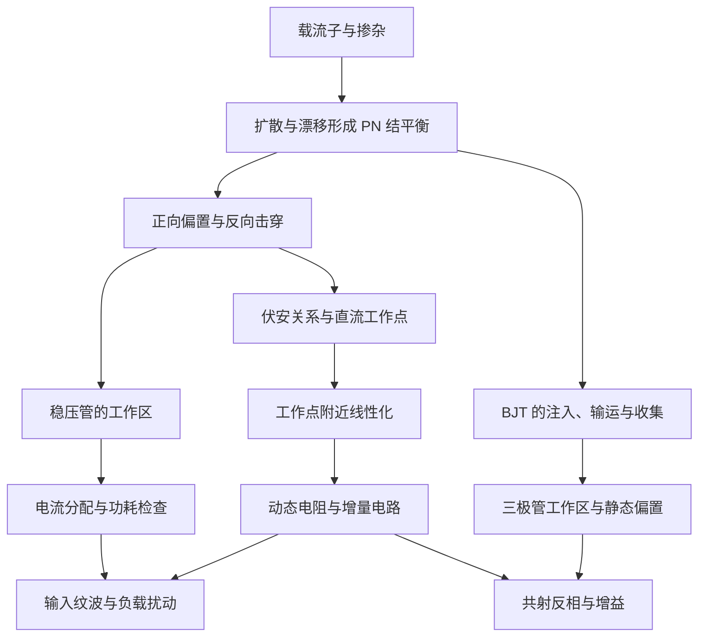

# 模拟电路目录

当前笔记从半导体与二极管出发，逐步进入三极管放大电路，建议按下面的顺序阅读。

| 顺序 | 笔记 | 要解决的问题 | 学完后应能做到 |
|---|---|---|---|
| 1 | [[1.半导体|半导体、PN 结与二极管]] | 掺杂、内建电场和偏置怎样影响电流？ | 判断电场方向、二极管状态，并选择合适模型 |
| 2 | [[2.微变等效电路|微变等效电路]] | 非线性器件为什么能在局部等效成电阻？ | 从工作点推导动态电阻，求小信号响应并检查条件 |
| 3 | [[3.稳压二极管|稳压二极管]] | 什么条件下能稳压，失稳后怎样计算？ | 分配电流、检查功耗、选择限流电阻、估算输出扰动 |
| 4 | [[4.三极管|三极管与共射放大电路]] | 三极管怎样控制电流，怎样判断放大与饱和？ | 验证工作区，从静态工作点推导共射小信号响应 |

## 知识关系

## 按问题查找

- 内建电场为什么由 N 指向 P？→ [[1.半导体#3. PN 结怎样形成]]
- $0.7\,\mathrm V$ 能不能当成严格导通门槛？→ [[1.半导体#5. 从物理过程到伏安方程]]
- $r_d$ 为什么与 $V/I$ 不同？→ [[2.微变等效电路#4. 动态电阻与静态电阻有什么区别]]
- 多小才算小信号？→ [[2.微变等效电路#5. “小”究竟与什么比较]]
- 直流电源为什么在增量电路中短路？→ [[2.微变等效电路#6. 怎样画微变等效电路]]
- 算出负的稳压管电流怎么办？→ [[3.稳压二极管#5. 一个例子贯穿“正常稳压”和“退出稳压”]]
- 怎样兼顾输入、负载范围来选电阻？→ [[3.稳压二极管#6. 串联电阻怎样选：先求上下界]]
- 为什么稳压管仍有输出纹波？→ [[3.稳压二极管#7. 用动态电阻解释输出为什么仍会变化]]
- 集电结反偏，为什么仍有较大的电流？→ [[4.三极管#2. 正向放大时，载流子怎样运动]]
- 怎样判断三极管是否饱和？→ [[4.三极管#4. 判断工作区：先看两个 PN 结]]
- 算出集电极电流后怎样验证假设？→ [[4.三极管#6. 完整静态例子：假设放大，再检查]]
- 共射为什么反相，输入电阻怎样影响增益？→ [[4.三极管#7. 工作点怎样连接到共射反相放大]]

## 本组笔记的记号约定

| 记号 | 含义 |
|---|---|
| $V_{DQ},I_{DQ}$ | 二极管的静态工作点 |
| $v_d,i_d$ | 相对工作点的增量 |
| $v_D,i_D$ | 总瞬时量，等于静态量加增量 |
| $\eta$ | 二极管理想因子，避免与电子浓度 $n$ 混淆 |
| $V_T=kT/q$ | 热电压，室温附近约 $25\sim26\,\mathrm{mV}$ |
| $r_d,r_z$ | 普通二极管、稳压管在相应工作点处的动态电阻 |
| $V_Z,I_Z$ | 稳压管反向电压、电流的正值大小，方向见第三篇 |
| $V_{CEQ},I_{CQ}$ | 三极管的输出静态工作点 |
| $v_{be},i_b,i_c$ | 三极管基射电压、基极电流和集电极电流的增量 |
| $\beta_{DC},\beta_{ac}$ | 直流电流增益与小信号电流增益 |
| $g_m,r_\pi$ | 三极管工作点处的跨导与基本模型的基射输入电阻 |

这些笔记采用基础器件模型。每次计算都先明确工作区与近似条件，再判断答案是否与假设一致。
